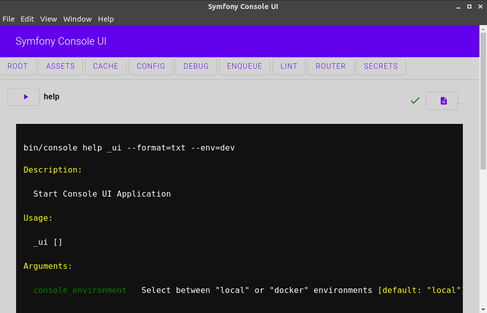

Console UI Bundle
============

> With great power comes great responsibility.

An interactive, real-time User interface for the Symfony Console.

> 🚧 We are at a developing stage, every contribution in every aspect will be welcomed and properly attributed.



## Tested OSs

* 🐧 Linux:
  * Ubuntu 20.04 + PHP 8.1
  * Ubuntu 20.04 + Symfony Docker
    
* 🍏 Mac OS:
  * M1 2020 + PHP 8.1
  * M1 2020 + Docker (Work in progress)

* 🪟 Windows:

> If you try it, you are encouraged to make a GitHub issue to let us know your experience :

## Features

- [x] Execute Single Command
- [x] Accept Input Arguments
- [x] Accept Input Options
- [ ] Accept Global Input Arguments
- [ ] Accept Global Input Options
- [ ] Copy Command Line to Clipboard
- [ ] Symfony Messenger Support
- [ ] Kill Command execution
- [ ] Flex recipe - Installer - Out of the box usage

## Todos

- [ ] 🛣️ Refactor the socket connection to avoid http1 limit of 6 concurrent connections

#### PHP 

- [x] 📢 Make it public
- [x] 🔼 Upload to packagist
- [ ] 🧟 The X-Men are meshing up around our testsuite 

#### TypeScript

- [x] 📢 Make it public
- [ ] 🔼 Extract web-component as NPM package
- [ ] 🛠️ Cover with unit tests

### Dependencies

#### System

* PHP 8.1 Or Docker
* NPM + Yarn

> We are working in a docker version to install system dependencies in a single command

#### App Build

* symfony/symfony/webpack-encore-bundle: Default

#### Socket Server

* symfony/mercure: Required

#### Queue System

* enqueue/enqueue-bundle: Default
* enqueue/enqueue-fs: Default


## Installation

Make sure Composer is installed globally, as explained in the
[installation chapter](https://getcomposer.org/doc/00-intro.md)
of the Composer documentation.

## Applications that use Symfony Flex

> We have not done any Flex recipe yet, look at the Applications that don't use Symfony Flex section for the bundle configuration.

Open a command console, enter your project directory and execute:

```bash
# We add all deps to ensure we dispatch every flex events. 
composer require --dev symfony/webpack-encore-bundle mercure enqueue/enqueue-bundle enqueue/fs drinksco/console-ui-bundle
```

If using Symfony Docker: Jump to step 4: Configure webpack.

If using local configuration check how to set up Mercure Hub in "Install Symfony Mercure Component and Hub" section.

## Applications that don't use Symfony Flex

### Step 1: Configure dependencies

#### Install Symfony Webpack Encore Bundle

Webpack Encore Bundle allows us to use modern Front-end languages inside our PHP applications.
Follow [the official docs](https://symfony.com/doc/current/frontend/encore/installation.html) to get it up and running.

```bash
# If not installed yet
composer require --dev symfony/webpack-encore-bundle
```

#### Install Symfony Mercure Component and Hub

Mercure is a high performance socket server, it allows us to get realtime console output in the UI. 
Follow [the official docs](https://symfony.com/doc/current/mercure.html) to get it up and running.

Using flex, Mercure will configure automatically for us.

```bash
# If not installed yet
composer require --dev mercure
```

> Using the [Symfony docker package](https://github.com/dunglas/symfony-docker) we can jump to the next step.

Mercure requires a dedicated Hub. You can use an open source version from [Mercure.Rocks](https://mercure.rocks/docs/hub/install).

Install it from release page https://github.com/dunglas/mercure/releases and at the moment we will choose the legacy
version for your SO.

Download the binary and put it in the project root.

> Why Mercure? It allows us to communicate between background running commands and frontend. We can search another
"more friendly" alternative  as running commands inside an 'http' request, but it will directly reduce the console tool
performance or it will not be possible to run long processes.

#### Install Forma-Pro Enqueue Bundle

Enqueue Bundle allows us to run commands in its own processes, when combined with Mercure Sockets it gives us the real-time
execution flow.

Follow [the official docs](https://php-enqueue.github.io/bundle/quick_tour/) to get it up and running.

Then install the Filesystem Transport it will do rest of the work 😉.

```bash
# If not installed yet
composer require --dev enqueue/enqueue-bundle enqueue/fs
```

### Step 2: Download the Bundle

Open a command console, enter your project directory and execute the
following command to download the latest stable version of this bundle:

While there is not recipe yet, we need to declare some environment variables for the Console UI

```env
# Local Config
CONSOLE_API_URL=http://localhost:3000
CONSOLE_UI_MERCURE_URL=http://localhost:3001/.well-known/mercure
CONSOLE_UI_JWT_SECRET="!ChangeThisMercureHubJWTSecretKey!"

# Symfony Docker Config
CONSOLE_API_URL=https://caddy:3000
CONSOLE_QUEUE_DSN=file:///srv/app/var/queue/enqueue?pre_fetch_count=1&polling_interval=100
CONSOLE_UI_MERCURE_URL=https://caddy/.well-known/mercure
CONSOLE_UI_MERCURE_PUBLIC_URL=https://caddy/.well-known/mercure
```

> Do not forget to set your absolute path with write read and write permissions for the queue dsn. Also, double-check
> the Mercure environment variables for host or port mismatches

```console
$ composer require --dev drinksco/console-ui-bundle
```

### Step 3: Enable the Bundle

Then, enable the bundle by adding it to the list of registered bundles
in the `config/bundles.php` file of your project:

```php
// config/bundles.php

return [
    // ...
    Drinksco\ConsoleUiBundle\ConsoleUiBundle::class => ['dev' => true],
];
```

### Step 4: Configure Webpack

> Console UI Web component should be updated to npm

Then [enable TypeScript support](https://symfony.com/doc/current/frontend/encore/typescript.html). Lastly add an
entry for the `console-ui` web component.

While we are not available `console-ui` component via npm, we need to install and configure it.

```javascript
// webpack.config.js
const Dotenv = require('dotenv-webpack');
...
    .addEntry('component-loader', './node_modules/@webcomponents/webcomponentsjs/webcomponents-loader.js')
    .addEntry('console-ui', './vendor/drinksco/console-ui-bundle/assets/app.js')
    ...
    // uncomment if you use TypeScript
    .enableTypeScriptLoader()
    ...
    .addPlugin(new Dotenv())
...
```

in the `package.json` file:

```json
...
    "main": "./vendor/drinksco/console-ui-bundle/main.js",
    "scripts": {
        ...
        "console-ui-start": "electron ."
    }
```

Install NPM dependencies

```bash
yarn add --dev @hotwired/stimulus @symfony/stimulus-bridge @symfony/webpack-encore core-js dotenv dotenv-webpack electron regenerator-runtime ts-loader typescript webpack-notifier @material/card @material/mwc-button @material/mwc-checkbox @material/mwc-circular-progress @material/mwc-dialog @material/mwc-formfield @material/mwc-icon @material/mwc-list @material/mwc-textfield @material/mwc-top-app-bar-fixed @webcomponents/webcomponentsjs lit material-components-web
```

Then build the Web Components
```bash
yarn encore production
```

### Step 5: Import Routes

```yaml
# config/routes/console-ui.yaml
when@dev:
    cli:
      resource: '@ConsoleUiBundle/Resources/config/console-ui/routes.yaml'
      prefix: /cli

```

Clear cache to load newly added routes.

```bash
bin/console cache:clear
```

### Step 6: Execute Electron App

Now, we have configured everything 😉, it is time to run our Symfony console UI🚀

```bash
# Local
bin/console _ui
# Symfony Docker
bin/console _ui docker
```

If you run into issues or want to give us feedback, you are encouraged to make a GitHub issue or a bug report.
